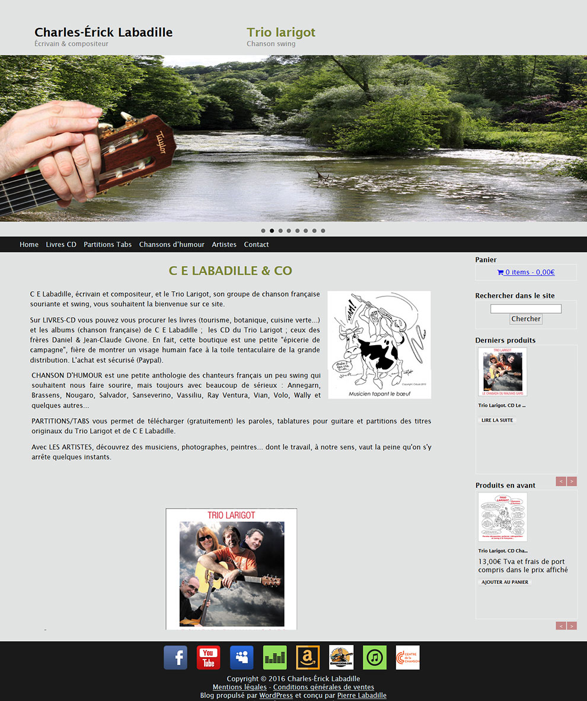

# ce-labadille
Personal site web of Charles-Erick Labadille : the purpose of this project is to present his (and friends) cultural work about music, art and literature. It work like a blog (with article, category...) but doesn't use the classic system. There is no inscription, no comments, no date of publication.
The website have is own market place to let the owners sell is product.

It's a personal project. The goals are to learn how to use Wordpress CMS from scratch (by doing my own theme), to use Woocommerce, to do multiple and personal WpLoop and finaly to answer the client need.

## Built with

* [`Wordpress`](https://fr.wordpress.com/)
* [`Php`](https://secure.php.net/)
* [`Javascript`](https://www.javascript.com/)

## Plugin used

* [`WooCommerce`](https://docs.woocommerce.com/documentation/plugins/woocommerce/)
* [`Yoast SEO`](https://yoast.com/wordpress/plugins/seo/)
* [`Google Analytics Dashboard for WP`](https://deconf.com/)
* [`UpdraftPlus`](https://updraftplus.com/)
* [`Media Library Assistant`](http://fairtradejudaica.org/media-library-assistant-a-wordpress-plugin/)
* [`Meta Slider`](https://www.metaslider.com/)
* [`Remove HTTP: Fix Mixed Content Warning`](https://wordpress.org/plugins/remove-http/)
* [`TinyMCE Advanced`](http://www.laptoptips.ca/projects/tinymce-advanced/)

## Technology used

* [`SSL`](http://www.ietf.org/)

## License

This project is licensed under the GNU License - see the [LICENCE](LICENSE) file for details
